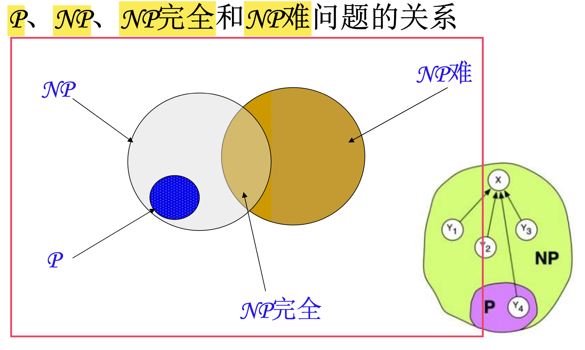

# 期末备考指南
>made by hbx

### 第2章 递归与分治策略
#### Algorithm：分治与递归
>阶乘函数
Fibonacci数列
Ackerman函数
全排列问题
整数划分问题
Hanoi塔问题
二分搜索技术
搜索技术：满字典树（变形的k叉树）+ 前缀树（字典树）+ 后缀树和后缀数组（实现了全部的轮回式遍历）※
大整数的乘法：快速傅里叶变换※
Strassen矩阵乘法
棋盘覆盖
合并排序
快速排序
线性时间选择
最接近点对问题（1D+2D）
循环赛日程表
### 第3章 动态规划
- 动态规划算法与分治法类似，其基本思想也是将待求解问题分解成若干个子问题
- 但是经分解得到的子问题往往不是互相独立的。不同子问题的数目常常只有多项式量级。在用分治法求解时，有些子问题被重复计算了许多次
- 如果能够保存已解决的子问题的答案，而在需要时再找出已求得的答案，就可以避免大量重复计算，从而得到多项式时间算法
#### Algorithm：动态规划
一、最优子结构
二、重叠子问题
三、备忘录方法（记忆化）

>矩阵连乘问题
最长公共子序列
凸多边形最优三角剖分
三角剖分的结构及其相关问题：一个表达式的完全加括号方式相应于一棵完全二叉树，称为表达式的语法树

>多边形游戏
图像压缩
电路布线：[动态规划案例-电路布线(含表格填写等超详细，纯人话讲解)_电路布线动态规划-CSDN博客](https://blog.csdn.net/vangoudan/article/details/106413539)

>流水作业调度
流水作业调度的Johnson法则
>背包问题（01）※
最优二叉搜索树※
最小编辑距离
### 第4章 贪心算法
>活动安排问题√
贪心算法的基本要素√
最优装载√
哈夫曼编码※
单源最短路径※ —— dijstra [最短路径算法-迪杰斯特拉(Dijkstra)算法 - 知乎 (zhihu.com)](https://zhuanlan.zhihu.com/p/346558578)
最小生成树※ —— Prim + Kruscral https://blog.csdn.net/weixin_44333151/article/details/110584056
多机调度问题——NP完全问题
分治、动态规划和贪心对比
### 第5+6章 搜索
>单源最短路径问题
装载问题
布线问题
0－1背包问题
最大团问题
旅行售货员问题
电路板排列问题
批处理作业调度
### 第7+8+9+10章
>纯概念
### 重点题型
##### 1. 考试算法实现大题：https://blog.csdn.net/SDAU_Ada/article/details/121294912
归并排序==over== [AcWing 787. 归并排序 - AcWing](https://www.acwing.com/activity/content/problem/content/821/)
快速排序==over== [AcWing 785. 快速排序 - AcWing](https://www.acwing.com/activity/content/problem/content/819/)
矩阵连乘问题——dp ==over==
最长公共子序列==over== https://www.acwing.com/activity/content/problem/content/1005/
背包问题（01）—— 贪心、动态规划、回溯  ==over==
布线问题——搜索 ==over== https://www.luogu.com.cn/problem/P1605
活动安排问题——贪心 ==over==  https://www.luogu.com.cn/problem/P1803
装载问题——dp ==over==
数塔问题——dp ==over== https://www.acwing.com/activity/content/11/
n皇后——搜索==over== https://www.acwing.com/activity/content/11/
马的遍历——搜索 ==over== https://www.luogu.com.cn/problem/P1443

------------------------------------------
##### 2. 算法简介与阐释：
哈密尔顿环
最小生成树
单源最短路径—— dijstra ==over==
着色问题的回溯算法
循环赛日程表
Dijkstra算法和Floyd算法异同 ==over==
【现阶段任务：将acwing上搜索那一节全部听完即可】

-----
##### 3. 文科问答题/判断题：
1. 渐进符号的定义与分析：O + Ω + Θ
2. 需要了解常见算法的复杂度！！！
3. 图灵机
4. P、NP、NP_hard、NPC：见后续
5. 近似算法（chapter9）
6. 三个基本计算模型：随机存取机、随机存取存储程序机、图灵机
7. 贪心算法要求：最优子结构性质 + 贪心选择性质
8. 动态规划要求：最优子结构性质 + 重叠子问题性质
9. 动态规划与分治法在分解子问题方面的不同点：dp分解后的子问题是“有重叠的”；分治法分解后的子问题是“独立的”
10. 分治法的基本思想：将规模为n的问题分解成k个规模较小的子问题，这些子问题相互独立且与原问题相同；如此递归，直至问题规模足够小，很容易求出解为止；再将求出的小规模问题的解合并成为一个更大规模的问题的解，自底向上还原求出原问题的解
11. 最优化原理：假设需要解决某一优化问题，需要依次做出n个决策: $D_1,D_2,...$，如果这个决策序列是最优的，那么对于任意整数k，不管前面k个决策如何，以后的最优决策只取决于前面决策所确定的当前状态，即：以后的决策$D_(k+1),D_(k+2),...$
12. 最优子结构性质：某个问题的最优解包含其子问题的最优解
13. 回溯法基本思想：在一棵含有问题全部可能解的状态空间树上进行dfs，解为叶子结点；搜索过程中，每到达一个节点时，则判断该节点为根的子树是否含有问题的解，如果可以确定该子树不含有问题的解，则直接放弃对这棵子树的搜索，回退到上层父节点，继续下一步dfs
14. 在回溯法中：并不是先构造出整颗状态空间树，再进行搜索的；而是在搜索过程中，逐步构建出状态空间树，即：边搜索，边构造！
15. 注意区分：这门课里面是区分“回溯法”（towards DFS）和“分支限界法”（towards BFS）的！、
16. 回溯法在问题的解空间树中，按照“深度优先”策略
17. 分支限界法在问题的解空间树中，按照“广度优先”策略
18. 回溯法的效率不依赖于：问题的解空间形式
19. 两种分支限界法是：（1）队列式分支限界法；（2）优先队列式分支限界法
20. 回溯法的算法框架按照问题的解空间一般分为：（1）子集树；（2）排列树
21. 子集树：所给的问题是从n个元素的集合S中找出满足某种性质的子集时，eg：01背包；遍历子集树的任何算法均需 Ω(2n) 的计算时间。
22. 排列树：所给的问题是确定n个元素满足某种性质的排列时，eg：批处理作业调度，旅行者售货问题；排列树通常有n！个结点，遍历排列树需要 Ω(n!) 的计算时间
23. NP完全性理论考试专区：
24. P是在多项式时间内使用==确定性算法==可解得所有判定问题的集合，NP是在多项式时间内使用==非确定性算法==可解的所有判定问题的集合
25. 设一个==非确定性算法==在时间T(n)内可以解决判定问题P0。则存在一个对应的==确定性算法==，它可在时间O($c^Tn$)内解决P0，其中c是一个常数
26. P ⊆ NP
27. 问题L是**NP完全的** 当且仅当：(1) L∈NP；(2) 对于所有L’∈NP有：L’ ∝ p L
28. 如果有一个问题L满足上述性质(2)，但不一定满足性质(1)，则称该问题是**NP难的**
29. 所有NP完全问题构成的问题类称为**NP完全问题类**，记为**NPC**
30. 
31. 设L是NP完全的，则：(1) L∈P当且仅当P＝NP；(2) 若L∝p L1，且L1∈NP，则L1是NP完全的
32. 概率算法考试专区：
33. 特征：对 *所求问题的同一实例* 用 *同一概率算法求解两次* 可能*得到完全不同的效果* ==所需的时间和结果可能都有很大的差别==
34. 数值概率算法：常用于求解数值问题，一般得到一个近似解（基本用不着）
35. 蒙特卡罗算法：用于求解问题的准确解。求得正确解的概率依赖于算法所用的时间（在一般情况下可以保证对问题的所有实例都以高概率给出正确解，但是通常无法判定一个具体解是否正确）
36. 拉斯维加斯算法：找到的解一定是一个正确解，但不保证一定能找到解；它所作的随机性决策有可能导致算法找不到所需的解$t(x) = p(x)s(x) + (1 - p(x))(e(x) + t(x))$
37. 舍伍德算法：总能求得一个解，且所求解总是正确的（思想：利用特殊技术，比如：提前随机洗牌，提前随机设定跳几步......以实现性能平均）