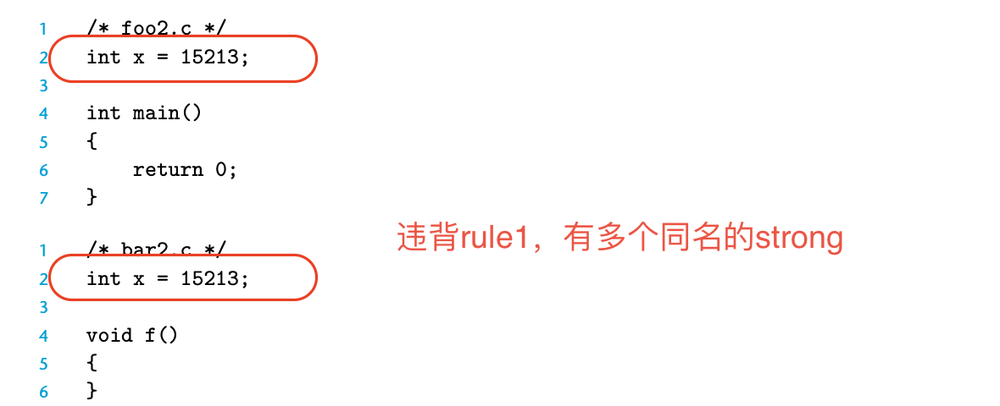
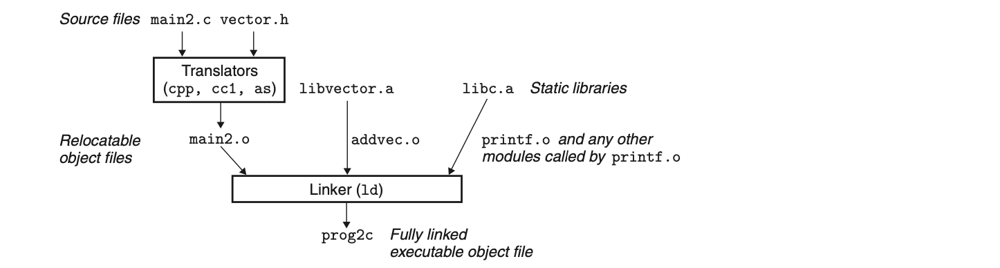
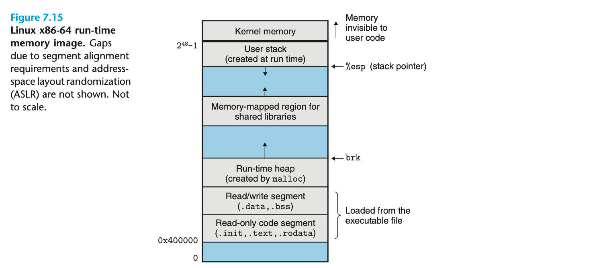

### 1）引入
- 链接(linking)是将各种代码和数据片段收集并组合成为一个单一文件的过程，这个文件可以被加载(复制)到内存中并执行
- 链接可以发生于编译时(compile time)，即：源代码被翻译成机器代码时
- 链接也可以发生于加载时(load time)，即：程序被加载器(loader)加载到内存并执行时
- 链接甚至可以发生于运行(run time)，即：由应用程序来执行
- 在现在系统中，链接是由链接器(linker)的程序自动执行的
- 链接器在软件开发中至关重要，因为它们使得“分离编译”(separate compilation)成为可能
- 如此可以将大的程序分解为更小/更易管理的模块，然后独立地修改和编译这些模块

### 2）编译器驱动程序（compiler driver）
#### 举个例子来说明：


宏观：在shell中键入即可
```unix
gcc -Og -o prog main.c sum.c
```
微观：
1. 将C的源程序main.c翻译成一个ASCII码的中间文件main.i
```unix
cpp [other-arg] main.c /tmp/main.i
```
2. 驱动程序运行C compiler(cc1)，它将main.i翻译成一个ASCII汇编语言文件main.s
```unix
cc1 /tmp/main.i -Og [other-arg] -o /tmp/main.s
```
3. 驱动程序运行汇编器(as)，它将main.s翻译成一个“可重定位目标文件”(relocatable object file) main.o
```unix
as [other-arg] -o /tmp/main.o /tmp/main.s
```
4. 驱动程序经过相同的过程生成一个“可重定位目标文件“ sum.o
5. 驱动程序运行链接器程序ld. ，将main.o和sum.o以及一些必要的系统目标文件组合起来，创建一个可执行目标文件(executable object file) prog
```unix
ld -o prog [system object files and args] /tmp/main.o /tmp/sum.o
```
6. 要执行可执行文件prog，只需要直接键入即可
```unix
./prog
```
7. shell调用操作系统中一个叫做加载器(loader)的函数,它将可执行文件prog中的代码和数据复制到内存，然后将控制转移到这个程序的开头

### 3）静态链接（static link）
- 像上述的linuxLD. 程序就叫静态链接器(static linker) 
- 它以一组可重定位目标文件和命令行作为输入，生成一个完全链接的、可以加载和运行的可执行目标文件作为输出
- 输入的可重定位目标文件由各种不同的代码和数据构成
- 目标文件纯粹是字节块的集合，这些block中包含程序代码/程序数据/引导链接器和加载器的数据结构...

链接器通常有两个任务：
1. 符号解析(symbol resolution)：
>目标文件中定义和引用符号，每个符号对应于一个函数/变量；符号解析的目的是将每个符号引用正好和一个符号定义关联起来
2. 重定位(relocation)：
>编译器和汇编器生成从地址0开始的代码和数据节，链接器通过把每个符号定义与一个内存位置关联起来，从而重定位这些节，然后修改这些符号的引用，使得它们指向这个内存位置

### 4）目标文件
#### 形式
1. 可重定位目标文件(relocatable object file)：由编译器和汇编器生成
>包含二进制数据和代码。其形式可以在链接时与其他可重定位目标文件合并起来，创建一个可执行目标文件

2. 共享目标文件：由编译器和汇编器生成
>一种特殊类型的可重定位目标文件，它可以在加载或运行时被动态加载进内存并链接

3. 可执行目标文件：由链接器生成
>包含二进制数据和代码。其形式可以被直接复制进内存并执行

### 5）可重定位目标文件

#### 单个解释：
- ELF header 描述了生成该文件的系统的字的大小和字节顺序
- ./text 已编译程序的机器代码
- ./rodata 只读数据，比如printf语句中格式串和switch语句的跳转表
- .data 已初始化的全局和静态C变量【==ps：局部变量在运行时被保存在stack中，不归链接器管==】
- .bss 未初始化的全局和静态C变量 以及 所有被初始化成0的全局和静态变量 【**这个节不占据实际的空间**，它仅仅只是一个占位符】
- 上述可以得知：【1】在目标文件中，**未初始化变量不需要占据任何实际的磁盘空间**。**运行时，再**在内存中**分配**这些变量，它们的初始值为0；【2】目标格式区分已初始化和未初始化变量是为了空间效率（“未初始化变量不需要占据任何实际的磁盘空间”）
- .symtab 一个符号表，它存放着：在程序中定义和引用的函数和全局变量的信息
- .rel.text 一个.text节中位置的列表，当链接器将这个目标文件和其他文件组合时，需要修改这些位置
- .rel.data 被模块引用或定义的所有全局变量的重定位信息【ps：==一般而言，任何已初始化的全局变量，如果它的初始值是一个全局变量addr或外部定义函数addr，都需要被修改==】
- .debug 一个符号调试表，其条目是程序中定义的局部变量和类型定义，程序中定义和引用的全局变量
- .line 原始C源程序和.text节中机器指令之间的映射
- .strtab 一个字符串表

### 6）符号与符号表
1. 每个可重定位目标模块m都有一个符号表，它包含m定义和引用的符号的信息
2. 在链接器的上下文中，有三种不同的符号：
- 自产可销型：由**模块m自身定义且能被其他模块引用**的*全局符号*，对应于*在模块m中定义的非静态的C函数和全局变量*
- 引入外来型：由**其他模块定义并被模块m引用**的*全局符号*，这些signal称为“外部符号“，对应于*在其他模块中定义的非静态C函数和全局变量*
- 自产自销型：**只被模块m定义和引用**的*局部符号*，它们对应于*带static属性的C函数和全局变量*。这些符号在m中的任何位置都可见，但是不能被其他模块引用
3. .symtab中的符号表不包括对应于本地非静态程序变量的任何符号，这些符号在运行时在stack中被管理，链接器对它们不感兴趣！
4. 上述“自产自销型”中带有C static属性的本地过程变量不在stack中管理；编译器在.data和.bss中为它们的每个定义分配空间
```cpp
比如下面这个例子：（充分说明了上述的三种类型，以及解释了3.与4.的含义）

==========================================================module M:

#include<n.h>         // 引入模块n的内容了！
int m = 666;          // 由模块m自身定义且能被其他模块引用的全局符号（自产可销）
int f()
{
    cout << n <<endl; // 由其他模块定义并被模块m引用的全局符号（引入外来）
    static int x = 0; // 只被m定义和引用的局部符号，在m中的任何位置均可见（自产自销）
    return x;
}

int g()
{
    int hbx = 7;      // 本地非静态程序变量，在运行时在stack中被管理，跟链接器没关系！
    static int x = 1; // 只被m定义和引用的局部符号，在m中的任何位置均可见（自产自销）
    return x;
}

==========================================================module N:
int n = 999;

有两个static int x 都可以在模块m中看见
此时编译器向汇编器输出两个不同名字的局部链接器符号
比如它用x.1表示函数f中的定义，用x.2表示函数g中的定义
```
5. 任何带有static属性声明的全局变量or函数都是模块m私有的；任何不带static属性声明的全局变量or函数都是公共的，可以被其他模块访问【一个好习惯就是给你的模块内全局变量打上static，这样可以防止多文件协作时的“紊乱”！】

### 7）符号解析
- 编译器只允许每个module中的每个局部符号有一个定义
- 静态局部变量也会有本地链接器符号，编译器还要确保它们有唯一的名字
- 当编译器遇见一个不在当前module定义的符号时，它会自动假设该符号是在其他模块内进行定义的，生成一个链接器符号表条目，并把它交给链接器处理；如果链接器在它的任何输入中都找不到这个被引用符号的定义，就输出一条错误信息并stop

#### （1）链接器如何解析多重定义的*全局符号*
1. strong：函数+已初始化的全局变量
2. weak：未初始化的全局变量
>这里可能大家会有一个==问题：局部变量应当如何解析==
>1. 局部变量（不带static）：只在所在的函数域内有效（连该函数域都出不去，还用说模块m码？！）
>2. 局部变量（不带static）：出不去模块m
>只允许每个module中的每个局部符号有一个定义，但凡有歧义直接报错！
3. 原则：
- 不允许有多个重名的strong符号
- 如果一个strong和一个weak符号重名，那么选择strong符号
- 如果有多个weak符号重名，那么则在这些weak符号中任选其一
##### 加以例证：


-------------


-----


----


----
```cpp
/* foo5.c */
#include<stdio.h>
void f(void);

int y = 15212;
int x = 15213;

int main()
{
    f();
    printf("...", x, y);
    return 0;
}

/* bar5.c */
double x;
void f()
{
    x = -0.0;
}

此时很显然违反了rule3，现在会“随机选择替换”！

如选择了 x = -0.0 来替换 x = 15212 就惨😭了！

//double 是 8 字节；int 是 4 字节
此 int x 的地址是 0x601020，y地址是 0x601024
这样x = -0.0复写 int x，会导致：双精度浮点覆盖内存中x和y的位置！！！！！！
```

#### （2）与静态库(static library)链接
- 相关函数可以被编译成为独立的目标模块，然后封装成为一个单独的静态库文件
- 应用程序可以通过命令行上制定单独的文件名字来使用这些在库中定义的函数（如：引入库#include<\cmath> ，再使用它里面的sqrt()函数）
- 这样，链接器将只复制被程序引用的目标模块，这就减少了可执行文件在磁盘和内存中的大小
##### 存放形式：
>静态库以一种称为“存档”(archive)的特殊文件格式存放在磁盘中，存档文件是一组连接起来的*可重定位的目标文件*集合，有一个头部用来描述每个成员目标文件的大小和位置。存档文件名由后缀.a标识！


#### （3）链接器如何使用静态库来解析引用
1. 符号解析阶段：链接器==从左到右==按照它们在编译器驱动程序的==命令行上出现的先后顺序==来扫描可重定位目标文件和存档文件
2. 扫描过程中，链接器维护【1】一个可重定位目标文件的集合E(这个set内的文件会被合并起来形成可执行文件)；【2】一个未解析的符号集合U(引用了但是尚未被定义的符号)；【3】一个在前面输入文件中已定义的符号集合D
3. 初始时：E、U、D均empty
##### 扫描过程详解：
- 【1】对于命令行上的每个输入文件f，链接器会判断它是目标文件(需求方)还是存档文件(供给方)
- 【2.1】如果是目标文件，就会将其添加到E，并修改U和D来反映符号定义与引用，并继续下一个输入文件
- 【2.2】如果是存档文件，那么链接器就尝试匹配U中未解析的符号和由存档文件成员定义的符号：如果某个存档文件成员m，定义了一个符号来解析U中的一个引用，那么就将m加进E，且链接器修改U和D来反映m中的符号定义与引用。
- 【2.2】对存档文件中的全部成员目标文件都依次进行这个过程，直到U和D都不再发生变化。此时，任何不包含在E中的成员目标文件都被discard，而链接器将继续处理下一个文件
- 【3】 如果当链接器完成对命令行上输入文件的扫描后，U是非空的，那么链接器就会输出一个错误并终止；否则，它会合并和重定位E中的目标文件，构建输出的可执行文件

##### 带来的小问题：
- 易见：命令行上的库和目标文件的顺序非常重要！
- 如果*定义一个符号的库*出现在*引用这个符号的目标文件*之前，那么引用就不能被解析，从而链接失败
##### 命令行书写顺序原则：
>先“引用”，再“出现”
【一般是将库放在命令行的结尾，让“供给方”出现的越晚越好！】

- 比如：foo.c 调用 libx.a 和 libz.a中的函数，而这两个库又调用liby.a中的函数，那么在命令行中 libx.a 和 libz.a 需要在 liby.a的前面！
```unix
linux> gcc foo.c libx.a libz.a liby.a
```

- 如果需要满足依赖关系，可以在命令行上重复库：比如，foo.c 调用 libx.a中的函数，该库又调用liby.a的函数，而liby.a需要调用libx.a中的函数，那么：
```unix
linux> gcc foo.c libx.a liby.a libx.a
```

### 8）重定位
>一旦链接器完成了符号解析这一步，就把代码中的每个符号引用和一个符号定义相关联（一一映射），此时链接器就知道它的输入目标模块中的*代码节*和*数据节*的确切大小，现在就可以开始重定位步骤了

- 重定位节和符号定义：
1. 链接器将所有类型相同的节合并为同一类型的新的聚合节【合并同类】
2. 链接器将运行时内存地址 赋给 新的聚合节、输入模块定义的每个节、以及输入模块中定义的每个符号【传递地址】
3. 此时，程序中每条指令和全局变量都有唯一的运行时内存地址了！

- 重定位节中的符号引用：
1. 在这一步中，链接器修改代码节和数据节中对每个符号的引用，使他们指向正确的运行时地址
2. over！

### 9）可执行目标文件
>看图即可，详细内容略


### 10）加载可执行目标文件
```unix
linux> ./prog
```
此时会发生什么？

1. shell调用某个贮存在存储器中的*加载器(loader)* 的操作系统代码来运行它
2. linux程序通过调用execve函数调用*加载器*
3. *加载器*将==可执行目标文件==中的代码和数据==从磁盘复制到内存==中
4. 然后通过跳转到程序的第一条指令 or 入口点来运行此程序
5. 这个将程序复制到内存并运行的过程叫做“加载”


### 11）动态链接共享库
>共享库(shared library)是一个目标模块，在运行或加载时，可以加载到任意的内存地址，并和一个在内存中的程序链接起来，这个过程叫做动态链接(dynamic linking)
- 在linux中，常以.so后缀来表示
- 在microsoft中，常用DLL(动态链接库)表示

### 12）位置无关代码
- 共享库的一个主要目的就是允许多个正在运行的进程，共享内存中相同的库代码，因而节约内存资源
- 现代系统以这样一种方式编译共享模块中的代码段，使得他们可以加载到内存的任何位置，而无需链接器修改
- 可以加载，而无需重定位的代码称为：*位置无关代码(PIC)*
### 13）库打桩(library interpositioning)机制
- 它允许你截获对共享库函数的调用，取而代之的是执行自己的代码
- 可以发生在编译时 / 链接时 / 运行时(程序被加载或执行)
##### 编译时打桩：
```unix
linux> gcc -DCOMPILETIME -c mymalloc.c
linux> gcc -I. -o intc int.c mymalloc.o
```
- 由于有-I.参数，所以会进行打桩，它告诉C预处理器在搜索常规的系统目录之前，先在当前目录寻找malloc.h文件
##### 链接时打桩：
```unix
1）先把源文件编译成可重定位目标文件：
linux> gcc -DCOMPILETIME -c mymalloc.c
linux> gcc -c int.c

2）目标文件链接成可执行文件：
linux> gcc -WI,--wrap,malloc -WI,--wrap,free -o intl int.o mymalloc.o
```
- linux使用--wrap f的格式表示对f进行链接时打桩
- -WI,option 表示将option传递给链接器
##### 运行时打桩：
- 具体格式略

##### 总结：
1. 编译时打桩：需要访问程序的*源代码*
2. 链接时打桩：需要访问程序的*可重定位对象文件*
3. 运行时打桩：只需要能访问*可执行目标文件* 即可

