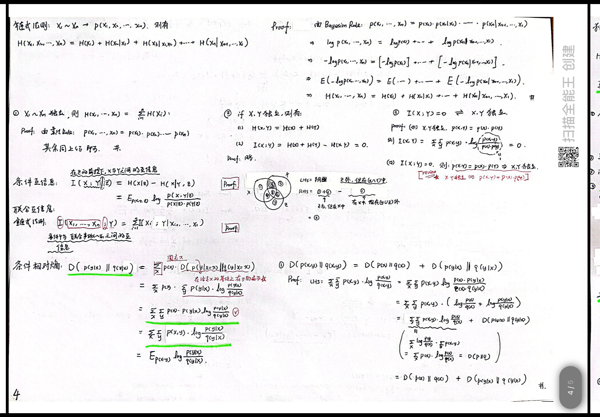

# Lecture14 - 笔者对于部分基础概念的整理复习
>所学课程来自[信息论课程-上海交大](https://www.bilibili.com/video/BV1kE411E7HX/?vd_source=8a3dd36862125e80dc439254ef65d959)，这里展示的是本人的学习笔记，仅供参考！

>信息论课程系列，笔者并未采用电脑markdown形式记录，而是采取ipad记笔记的方式，为的是保持数学的纯粹性！故此处上传的是笔记图片，加载较慢，请稍等

