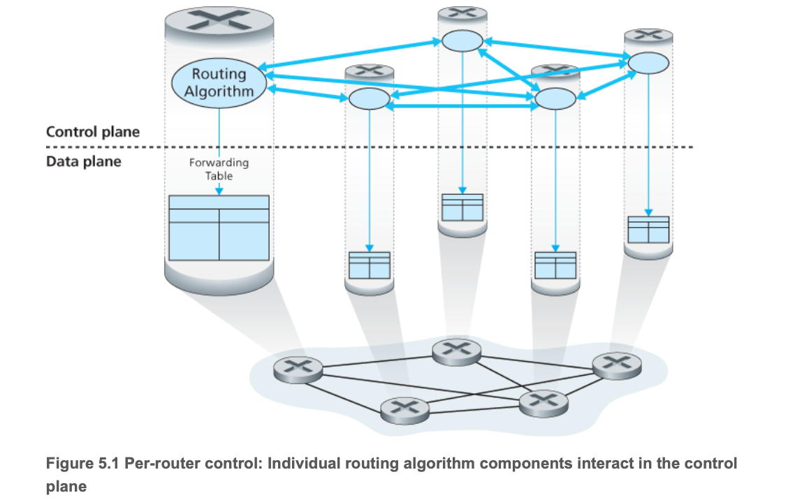
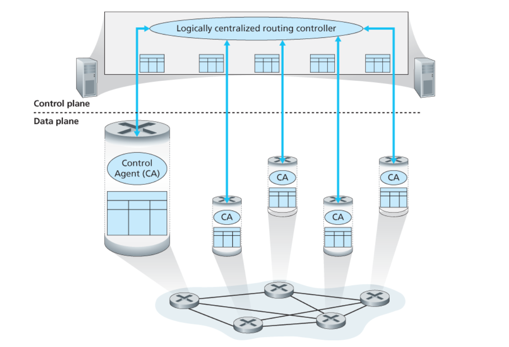
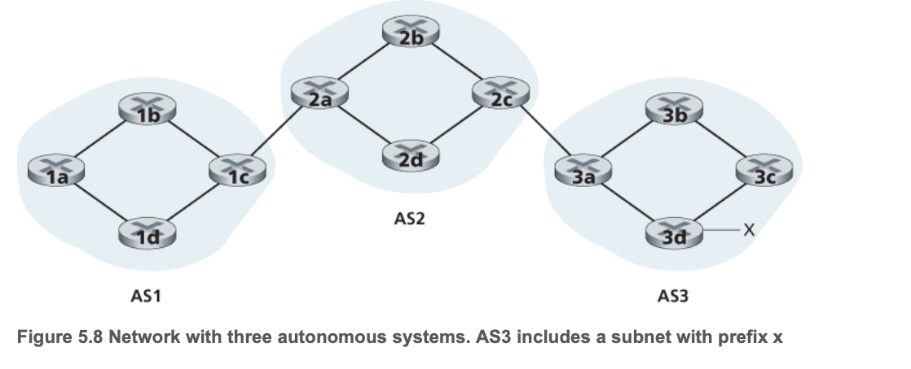
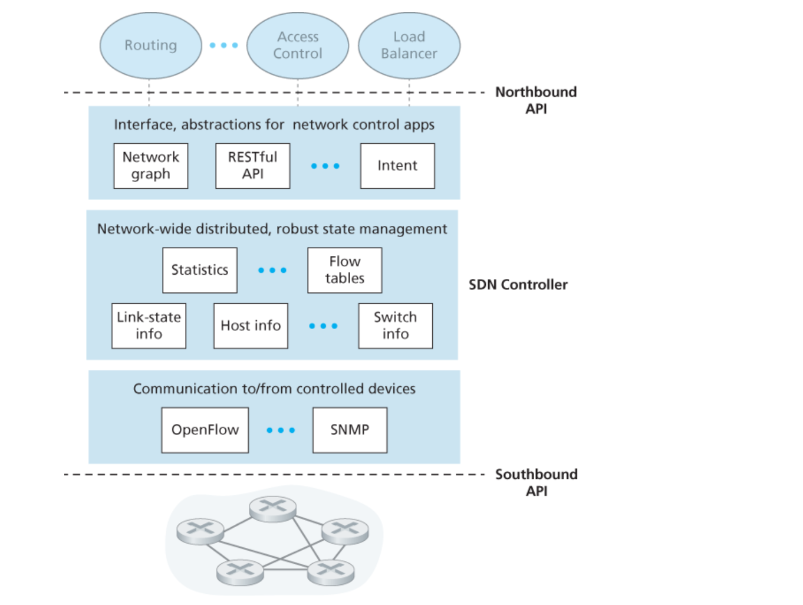

# Chapter5 网络层：控制平面
### 1）概述
#### 控制平面
>一种网络范围的逻辑，不仅控制沿着从源主机到目的主机的端到端路径间路由器如何转发数据报，而且控制网络层组件和服务如何配置与管理
#### 转发表(基于目的地转发的场景)与流表(在泛化转发的场景)如何计算/维护/安装
##### （1）每路由器控制：
>1. 每台路由器都包含转发与路由选择功能；
>2. 每台路由器都有一个路由选择组件，用于和其他路由器中的路由选择组件通信，以计算其转发表的值；
>3. OSPF协议 与 BGP协议 都是基于此方法进行控制的

##### （2）逻辑集中式控制：
>1. 泛化的“匹配+操作”抽象允许执行传统的IP转发以及其他功能；
>2. 该控制器经一种定义良好的协议与每台路由器中的一个控制代理 (Control-Agent , CA) 进行交互，以配置/管理该路由器的转发表；
>3. CA的任务很简单，就是与控制器进行通信并且按控制器的命令行事
>4. 这些CA既不能直接相互交互，也不能主动参与计算转发表 ——（它就是控制器小姐的🐶，🤡）

### 2）路由选择算法(routing algorithm)
#### （1）简介：
- 目的是从发送方到接收方的过程中选择一条通过路由器网络的好的路径( <=> 路由 )
- Generally，一条好的路径指：具有最低开销的路径
- 有一条“界限感”规则：属于组织Y的路由器x不应该转发任何来源于组织Z所属网络的分组
#### （2）分类：
##### 【1】按照集中式和分散式来划分
###### 集中式路由选择算法(centralized routing algorithm)：
>\[1] 用完整性的、全局性的网络知识计算出从源到目的地之间的最低开销路径;
>\[2] 要求算法在开始前，要以某种预处理获得整体网络布局的信息;
>called：链路状态算法(Link State, LS)，因为该算法必须要知道网络中的每条链路的开销
###### 分散式路由选择算法(decentralized routing algorithm)：
>\[1] 没有节点拥有整个网络链路开销的完整信息;
>\[2] 每个节点仅有与其直接相连链路的开销知识即可开始工作;
>\[3] 然后通过迭代计算过程以及与相邻节点的信息交换，一个节点开始逐渐计算出到达某目的节点or一组目的节点群的最低开销路径
>called：距离向量算法(Distance-Vector, DV)
##### 【2】按照算法是静态的or动态的来划分
###### 静态路由选择算法(static routing algorithm)：
>路由随时间变化非常缓慢，常是人工进行调整
###### 动态路由选择算法(dynamic routing algorithm)：
>随着网络负载/拓扑结构发生变化而改变路由选择路径

- ps：虽然动态路由选择算法易于对网络的变化作出反应，但也容易受到诸如 *路由选择循环* or *路由振荡* 之类的问题
##### 【3】按照是负载敏感的or负载迟钝的进行划分：
###### 负载敏感算法(load-sensitive routing algorithm)：
>1. 链路开销会动态地变化以反映出底层链路的当前拥塞水平；
>2. 如果拥塞的一条链路与高开销相联系，则路由选择算法趋向于绕开该拥塞链路来选择路由
###### 负载迟钝算法(load-insensitive routing algorithm)：
>当今的internet路由选择算法（比如OSPF与BGP）都是负载迟钝的，因为某条链路的开销并不明确地反映其当前(or 最近)的拥塞水平
##### 上述算法的具体机理略，详见原书！
### 3）因特网中自治系统内部的路由选择：OSPF
#### 1. 引入：
当前互联网路由器集合面临两个重要问题：
- 规模
- 管理自治

>- [1] 这两个问题都可以通过将路由器组织进 **自治系统(Autonomous System, AS)** 来解决，其中每个AS由一组通常处在相同管理下的路由器组成
>- [2] Generally：在一个ISP中的路由器以及互联它们的链路构成一个AS
>- [3] But：也存在某些ISP（通常是巨无霸一级ISP）将它们的网络划分为多个AS
>- [4] 一个自治系统由其全局唯一的 **AS号(ASN)** 所标识，就像IP地址那样，ASN由ICANN区域注册机构所分配
>- [5] 在相同的AS中的路由器都 *运行相同的路由选择算法* 并 *含有彼此的信息*
>- [6] 在一个==自治系统内运行==的routing algorithm叫作：**自治系统内部路由选择协议(intra-autonomous system routing algorithm)**

#### 2. 开放最短路优先（OSPF）
1. 全称：Open Shortest Path First（开放最短路径优先）
2. OSPF是一种链路状态路由协议，它使用==Dijkstra算法==来计算最短路径，从而确定数据包在网络中的传输路径
3. 各条链路的开销是由网络管理员进行配置的：
>- 如果将所有链路开销配置成1，可以实现最小跳数的路由选择;
>- 如果将链路权值按与链路容量成反比来配置，可以实现不鼓励*流量使用低宽带链路*

4. 使用OSPF时，路由器向自治系统内的==所有==*其他路由器* 广播路由选择信息，而不仅仅是向其*相邻路由器* 广播
5. 更新与自更新：
>- 每当一条链路的状态发生变化时(eg:开销变化/连接or中断状态变化)，路由器就会广播链路状态信
>- 即使链路状态没发生变化，它也要周期性地(min duration: 30min)广播链路状态
6. OSPF优点：
- 安全
- 多条相同开销的路径
- 对单播和多播路由选择提供综合支持
- 支持在单个AS中的层次结构
### 4）ISP之间的路由选择：BGP
#### [1] BGP的引入：
1. ISP：互联网服务提供商（Internet Service Provider，ISP）
2. BGP：边界网关协议（Border Gateway Protocol，BGP）
3. 引入：
>- 刚刚谈到的**OSPF**是一个**AS内部**的路由选择协议，当在**相同的AS内**对源和目的地之间进行分组选路径时，分组遵循的路径完全由**AS内路由选择协议**所决定
>- But！当分组==跨越多个AS==进行路由时，就需要一个**自治系统间路由选择协议(inter-autonomous system routing protocol)**
4. 显然AS间路由选择协议涉及多个AS之间的协调，所以==AS通信必须运行相同的AS间路由选择协议==
5. 在因特网中，所有的AS运行相同的AS间路由选择协议，称为**边界网关协议(BGP)**
6. 很显然，BGP作为“胶水”，将成千上万的ISP“粘合”在一起！
#### [2] BGP的作用：
###### BGP形式
1. review：考虑一个AS和该AS内的任一路由器，每台路由器都具有一张转发表，该转发表在将到达分组转发到路由器链路的过程中起着重要作用；对于位于相同的AS中的目的地而言，在路由器转发表中的表项由AS内部路由选择协议决定
2. 在BGP中，分组并不是路由到一个特定的目的地址，而是路由到CIDR化的前缀，其中每个前缀表示一个子网or一个子网的集合
3. 因此：每个路由器转发表的表项，实质上形式为：( x , I )，其中 x 是前缀，I 是该路由器接口之一的借口号【理解：哪个子网 + 子网中的who】
###### BGP为每台router提供了一种完成下列任务的手段
- 从邻居AS获得前缀的可达性信息：
>BGP允许每个*子网* 向internet的其余部分通告*它* 的存在；而BGP确保在internet中的所有AS知道该子网
- 确定到该前缀的“最好”路由：
>*一台路由器* 可能知道两条或更多条到特定前缀的不同路由，为了确定这是best，*它* 将本地运行一个BGP的路由选择过程
#### [3] 通告BGP的路由信息：

###### 组分：
- 有三个自治系统：AS1 & AS2 & AS3
- AS3包含一个具有前缀 x 的子网
- 每个AS中的子网中的路由器有两重身份：\[1] 网关路由器(gateway router) ，处于AS边缘; \[2] 内部路由器(internal router)
###### 通告过程：（比如AS3要向其他所有路由器通告对于前缀x的可达性信息）
- AS3向AS2发送一个BGP报文，说“x存在，而且就在AS3内部”，将此报文记作：“ AS3 x ”
- AS2向AS1发送一个BGP报文，说“x存在，你能够先通过AS2，再进入AS3，进而获取x”，将此报文记作：“ AS2 AS3 x ”
- 以这种方式，每个自治系统不仅知道x的存在，而且知道通向x的自治系统(AS)路径
- 具体机理略，详见原书！
#### [4] 确定最好的路由：
##### raise ques：
正如我们刚刚所了解的那样，从一个给定的路由器到一个目的子网可能有多条路径，那么一台路由器如何在这些路径之间进行选择（并且再相应地配置它的转发表）呢？
##### noun解释：
1. 当路由器通过BGP连接通告前缀时，它在前缀中包括一些BGP属性(BGP attribute)。用BGP的术语来说，前缀及其属性称为路由(route)
2. 有两个重要的属性值得关注：AS-PATH 和 NEXT-HOP
3. AS-PATH：包含通告已经通过的AS的列表
>- 为了生成AS-PATH的值，当一个前缀通过某AS时，该AS将其ASN加入AS-PATH的现有列表中
>- BGP路由器还使用AS-PATH属性来检测和防止通告环路
4. NEXT-HOP：具有敏感而重要的作用
>NEXT-HOP是AS-PATH起始的路由器接口的**IP地址**
5. 显然，每条BGP路由包含三个组件：NEXT-HOP + ASPATH + 目的地前缀
##### 选择策略：
###### 【1】介绍“热土豆路由选择”：
- 热土豆路由选择：hot potato routing
- main theme： 对于一个路由器来说，需要尽可能快地将分组送出其AS，而不担心其AS外部到目的地的余下部分的开销
- 因此，热土豆路由选择是：自私的算法。即：它试图减小在它自己AS内部的开销，而忽略在其AS之外的端到端开销的其他部分
###### 【2】路由器选择算法：
- 如果仅有一条路由，那么BGP显然选择该路由
- 如果到相同的前缀有两条及以上，路由则按顺序调用下面的消除规则，直到余下一条路由！
###### 消除规则：

#### [5] 知识汇总：当你需要开互联网公司时，需要做些什么？
>这一部分相当精彩，涉及了IP.addr / DNS / BGP ！内容丰富，建议大家详见原书！
### 5）SDN控制平面
#### （1）复习：
- 网络中的转发设备called：分组交换机
- SDN体系结构具有4个关键特征：
>- 基于流的转发
>- 数据平面与控制平面分离
>- 网络控制功能
>- 可编程的网络
- 之前提到的SDN以外的网络模式中，交换机/路由器作为一个整体，它是垂直的/综合的，并且由单一的厂商所销售；SDN完全不同，它提供了一个更加丰富、开放的生态系统
#### （2）SDN控制平面：SDN控制器 + SDN网络控制应用程序

##### 通信层
>负责：SDN控制器和受控devices之间的通信
>- SDN控制器通过一个协议来传送指令等信息
>- 设备必须能够向控制器传递本地观察到的事件
##### 网络范围状态管理层
>由SDN控制平面所做出的最终控制决定
##### 对于网络控制应用程序层的接口
>控制器通过它的“北向接口”与网络控制应用程序交互，该API允许网络控制应用程序在状态管理层之间读/写网络状态和流表
#### （3）OpenFlow协议：

###### 运行在 *SDN控制器* 和 *SDN控制的交换机* 或其他实现OpenFlowAPI的设备之间
###### 从控制器流向受控交换机的重要报文如下：
- 配置：该报文允许控制器*查询并设置*交换机的配置*参数*
- 修改状态：该报文由控制器使用，以增加or删减/修改交换机流表中的表项
- 读状态：该报文被控制器用于在受控交换机从特定的端口发送出一个特定的报文
>上述"特定的报文"有：
>- 流删除
>- 端口状态
>- 分组入(packet-in)
### 6）ICMP：因特网控制报文协议
- 因特网控制报文协议 (Internet Control Message Protocol)
- 作用：被主机和路由器用来彼此沟通网络层的信息
- 经典用处：差错报告
- ICMP被认为是IP的一部分，但从体系结构上来说它位于IP之上：ICMP_message是承载在IP分组中的，这就是说，ICMP是IP的有效载荷承载的，就像TCP/UDP报文段作为IP段有效载荷一样；当一台主机收到一个指明上层协议为ICMP的IP数据报时，它分解出该数据报的内容给ICMP，就像分解出一个数据报内容给TCP或UDP一样
### 7）网络管理
#### (1) def：网络管理员在执行任务时所使用的体系结构、协议、信息库
#### (2) 网络管理协议：

##### 管理服务器（manage server）：
- 是一个应用程序，运行在网络运营中心（Network Operations Center，NOC）的集中式网络管理工作站上
- 需要网络管理员(human)在环路中
- 它是执行网络管理活动的地方
- 它控制网络管理信息与命令的收集、处理、分析、显示
- 它在这里发起配置、监视、控制网络的被管设备的操作
##### 被管设备（managed devices）：
- 显而易见就是我们日常的devices，比如：主机、路由器、交换机、中间盒...其他联网设备
- 设备本身具有可管理的组件（网络接口），以及这些硬件和软件组件的配置参数（OSPF之类的协议）
##### 网络管理代理（network management agent）：
- 是一个运行在被管设备上的软件进程
- 它与管理服务器直接通信，在其命令与控制下在被管设备上执行本地操作
##### 网络管理协议（network management protocol）：
- 该协议运行在 *管理服务器* 与 *被管设备* 之间
- 允许 *管理服务器* 查询 *被管设备* 的状态，并经过其代理间接在这些devices上执行操作
- 允许向 *管理服务器* 报告异常事件（eg：组件故障、超过性能阈值）
- 它自己没办法管理网络，它只是桥梁🤡

##### 现实中：运营商执行管理网络的三种方式
- CLI（Command Line Interface，CLI）：直接向设备发出命令行接口
- SNMP / MIB：
>- [1] SNMP（Simple Network Management Protocol ，SNMP）简单网络管理协议，用于在 *管理服务器* 和 *代表管理服务器执行的代理* 之间传递网络管理控制和信息报文，最常使用的就是“请求响应模式”；
>- [2] MIB (Management Information Base , MIB) 管理信息库；
>- [3] 网络运营商可通过SNMP查询/设置devices的MIB对象中包含的数据
- NETCONF / YANG：略